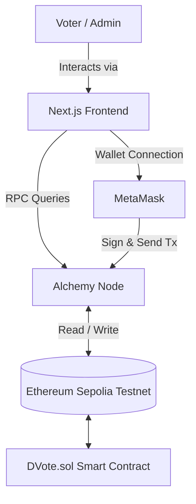

# D-VOTE

D-VOTE is a modern, decentralized voting application (dApp) designed to provide secure, transparent, and immutable voting mechanisms for corporate governance and community decision-making. By leveraging Ethereum smart contracts and a polished Next.js frontend, D-VOTE ensures that every vote is cryptographically secure and publicly verifiable.

---

## Problem Statement

Traditional electronic voting systems often suffer from a lack of transparency, susceptibility to database tampering, and a lack of voter trust. Centralized databases can be altered without detection, and auditing the results relies on trusting a central authority. For corporate governance and high-stakes community decisions, this lack of verifiability is a critical vulnerability.

## Solution Overview

D-VOTE solves this problem by moving the core voting logic and tallying process to the Ethereum blockchain. By deploying immutable smart contracts, the system guarantees that once an election is created and votes are cast, the data cannot be altered or deleted. The application provides an intuitive, high-quality user interface that abstracts the complexity of Web3, allowing administrators to seamlessly create elections and voters to securely cast their ballots using their cryptocurrency wallets.

## Key Features

- **Web3 Wallet Authentication**: Secure login and transaction signing using MetaMask.
- **On-Chain Election Creation**: Administrators can define election titles, purposes, duration, and candidates directly on the Sepolia testnet.
- **Local Voter Registration**: Seamless UI for administrators to whitelist Ethereum addresses for specific elections (currently in local UI preview).
- **Secure Voting Mechanism**: Voters can securely cast their ballots, ensuring one vote per registered address (currently transitioning to full on-chain execution).
- **Real-Time Transparent Tallies**: Vote counts and election winners are computed and displayed instantly upon the election's conclusion.
- **Network Awareness**: Automatically prompts users to switch to the Sepolia testnet to prevent mainnet gas expenditures.

## System Architecture



### Components and Data Flow
1. **Client**: The Next.js frontend provides the user interface.
2. **Provider**: `ethers.js` (v6) and `viem` interface with the blockchain. `ethers.js` handles transaction signing via MetaMask, while `viem` manages read-heavy RPC queries via Alchemy.
3. **Smart Contract**: `DVote.sol` maintains the source of truth for active elections, registered voters, and the current vote tally.

## Technical Architecture

- **Frontend**: Built with Next.js 14 (App Router) to ensure fast rendering and optimized routing. The UI is constructed using React 18, Tailwind CSS, and Radix UI primitives via shadcn/ui for accessible, responsive components.
- **Backend (Smart Contracts)**: Written in Solidity `^0.8.20`. Compiled, tested, and deployed using the Hardhat development environment.
- **Database**: The application is designed to be fully decentralized. The Ethereum Sepolia Testnet acts as the database for all election configurations and voting tallies. *(Note: The current UI utilizes `localStorage` for optimistic state updates and local prototyping of the voter registration flow)*.
- **Infrastructure**: Alchemy is utilized as the primary RPC provider to ensure high-availability querying of blockchain state.

## Project Structure

```text
DVOTE/
├── backend/                   # Smart Contract Development Environment
│   ├── contracts/             # Solidity source files (DVote.sol)
│   ├── ignition/modules/      # Hardhat deployment scripts
│   ├── test/                  # Contract unit tests (Chai/Mocha)
│   └── hardhat.config.js      # Hardhat configuration and network setup
├── frontend/                  # Next.js Web Application
│   ├── app/                   # App Router pages and layouts
│   ├── components/            # Reusable UI components (shadcn/ui)
│   ├── lib/                   # Web3 utilities (ethers.js, viem, ABIs)
│   ├── public/                # Static assets
│   └── tailwind.config.js     # Tailwind CSS configuration
└── README.md                  # Project documentation
```

## Technology Stack

**Frontend**
- Next.js 14 (App Router)
- React 18
- Tailwind CSS
- shadcn/ui & Radix UI

**Web3 & Blockchain**
- Solidity `^0.8.20`
- Hardhat
- ethers.js v6
- viem

**Infrastructure & Tooling**
- Alchemy RPC
- MetaMask

## Installation

### Prerequisites
- Node.js (v18 or higher)
- npm or pnpm
- MetaMask browser extension

### 1. Clone the repository
```bash
git clone https://github.com/your-username/DVOTE.git
cd DVOTE
```

### 2. Install Backend Dependencies
```bash
cd backend
npm install
```

### 3. Install Frontend Dependencies
```bash
cd ../frontend
npm install
```

## Configuration

You need to set up environment variables for both the backend and frontend.

### Backend Configuration
Create a `.env` file in the `backend/` directory:
```env
# Alchemy or Infura RPC URL for the Sepolia testnet
SEPOLIA_RPC_URL="https://eth-sepolia.g.alchemy.com/v2/YOUR_ALCHEMY_API_KEY"

# Your wallet's private key (Do NOT use a wallet with real funds!)
PRIVATE_KEY="your_wallet_private_key"

# Etherscan API key for verifying contracts
ETHERSCAN_API_KEY="your_etherscan_api_key"
```

### Frontend Configuration
Create a `.env` file in the `frontend/` directory:
```env
NEXT_PUBLIC_SEPOLIA_RPC_URL="https://eth-sepolia.g.alchemy.com/v2/YOUR_ALCHEMY_API_KEY"
```

## Running Locally

### 1. Compile the Smart Contracts
```bash
cd backend
npx hardhat compile
```

### 2. Run the Next.js Frontend
Open a new terminal window:
```bash
cd frontend
npm run dev
```
The application will be available at `http://localhost:3000`.

## API Documentation

The application interacts with the blockchain via RPC rather than a traditional REST API. 

### Smart Contract Methods (`DVote.sol`)
- `createElection(string _title, string _purpose, uint256 _startDate, uint256 _endDate, string[] _candidateNames)`: Creates a new election on-chain.
- `addVoter(uint256 _electionId, address _voter)`: Whitelists a voter for a specific election (Creator only).
- `castVote(uint256 _electionId, uint256 _candidateIndex)`: Casts a vote for a candidate.
- `getElectionDetails(uint256 _electionId)`: Returns public details and current tallies for an election.

### Alchemy RPC Endpoints
The frontend utilizes the `viem` client to interact with Alchemy-specific endpoints:
- `alchemy_getAssetTransfers`: Queries token transfer history.
- `alchemy_getTokenBalances`: Queries token balances for specific addresses.

## Security Considerations

- **Access Control**: The smart contract enforces an `onlyCreator` modifier, ensuring that only the wallet address that created an election can add voters or manually end the election.
- **Time-bound Execution**: The `electionActive` modifier ensures votes can only be cast between the defined `startDate` and `endDate`.
- **Double Voting Protection**: The contract tracks `hasVoted` per address per election, strictly preventing multiple votes from a single wallet.
- *Development Note*: The frontend currently utilizes local browser state (`localStorage`) for voter registration tracking to facilitate rapid UI prototyping. In a production environment, all voter state must be resolved exclusively via the on-chain contract state.

## Testing

The backend includes a test suite for the smart contracts.

To run the smart contract tests:
```bash
cd backend
npx hardhat test
```

To run gas consumption reports:
```bash
REPORT_GAS=true npx hardhat test
```

## Deployment

### Smart Contract Deployment
To deploy the `DVote.sol` contract to the Sepolia testnet, create an Ignition module and run:
```bash
cd backend
npx hardhat ignition deploy ./ignition/modules/DVote.js --network sepolia
```
*Note: Update `DVOTE_CONTRACT_ADDRESS` in `frontend/lib/contract.ts` with the new address after deployment.*

### Frontend Deployment
The frontend is optimized for deployment on Vercel:
1. Push your code to GitHub.
2. Import the project into Vercel.
3. Set the Root Directory to `frontend`.
4. Add the `NEXT_PUBLIC_SEPOLIA_RPC_URL` environment variable.
5. Deploy.

## CI/CD

Currently, the project relies on Vercel's automated build pipelines for frontend continuous deployment. Every push to the `main` branch triggers a new production build. Smart contract testing and deployment are currently handled manually via the Hardhat CLI.

## Performance & Scalability

- **Frontend**: The Next.js App Router and server-side optimizations ensure fast initial page loads.
- **Blockchain**: By deploying on Ethereum (or an L2 rollup in the future), the application inherits the network's security guarantees. Gas optimization is enabled in the Solidity compiler (`runs: 1000`) to minimize the cost of deploying elections and casting votes. 

## Future Improvements

- **Full On-Chain Integration**: Migrate the frontend `addVoter` and `castVote` logic from local state prototyping to full smart contract interaction.
- **Zero-Knowledge Proofs (ZKPs)**: Implement ZK-SNARKs to allow anonymous voting, hiding voter identities while mathematically proving vote validity.
- **L2 Migration**: Deploy the contract to Arbitrum or Optimism to dramatically reduce transaction fees for voters.
- **DAO Integration**: Allow existing ERC-20 token holders to automatically inherit voting rights based on token snapshots.

## Contributing

Contributions are welcome! Please follow these steps:
1. Fork the repository.
2. Create a new branch (`git checkout -b feature/amazing-feature`).
3. Commit your changes (`git commit -m 'Add amazing feature'`).
4. Push to the branch (`git push origin feature/amazing-feature`).
5. Open a Pull Request.

## License

This project is open-source and available under the MIT License.